# Sensorless PMSM Field-Oriented Control (FOC) & Inverter Digital Twin

An interactive in-browser digital twin simulating vector control, Space Vector PWM (SVPWM), and sensorless back-EMF state estimation in Permanent Magnet Synchronous Motors (PMSM), modeling industrial variable speed drives (such as Danfoss VLT and VACON series).

🔗 **Live In-Browser Simulator:** [https://elomarjc.github.io/pmsm-foc-drive-twin/](https://elomarjc.github.io/pmsm-foc-drive-twin/)

---

## 1. System Architecture & Control Overview

Industrial variable speed drives (VFDs) require precise torque regulation from zero to rated speed without mechanical shaft encoders, which add cabling points of failure in harsh environments. 

This digital twin implements the complete vector control and inverter modulation architecture:

```mermaid
flowchart LR
    subgraph Speed & Current Regulation
        W_REF[Speed Ref omega*] --> SPEED_PI[Speed PI Controller]
        SPEED_PI --> IQ_REF[Torque Ref iq*]
        ID_REF["Flux Ref id* = 0"]
        
        ID_REF & IQ_REF --> PI_CURR[Decoupled Current PI Loops]
        PI_CURR --> VD_VQ["Voltage Demands (vd*, vq*)"]
        VD_VQ --> INV_PARK[Inverse Park Transform]
        INV_PARK --> VALPHA_BETA["Stationary Voltages (v_alpha, v_beta)"]
    end

    subgraph Modulation & Power Stage
        VALPHA_BETA --> SVPWM[Space Vector PWM 10 kHz]
        SVPWM --> INV[3-Phase 560V Inverter Bridge]
        INV --> PMSM[Interior PMSM Motor]
    end

    subgraph Sensorless State Estimation
        PMSM --> SENS["Phase Current Sensors (ia, ib, ic)"]
        SENS --> CLARKE[Clarke Transform i_alpha, i_beta]
        CLARKE --> SMO[Sliding Mode Observer]
        SMO --> EMF["Estimated Back-EMF (e_alpha, e_beta)"]
        EMF --> PLL["Rotor Angle & Speed (theta_hat, omega_hat)"]
        PLL -.->|Estimated Angle| INV_PARK
    end
```



---

## 2. Mathematical Foundations

### 2.1 PMSM Dynamic State-Space Model in Synchronous $dq$ Coordinates

In the rotating reference frame aligned with rotor magnetic flux:

$$
\frac{d i_d}{dt} = \frac{1}{L_d} \left( v_d - R_s i_d + \omega_e L_q i_q \right)
$$

$$
\frac{d i_q}{dt} = \frac{1}{L_q} \left( v_q - R_s i_q - \omega_e L_d i_d - \omega_e \psi_{pm} \right)
$$

where:
* $R_s = 0.45\ \Omega$ is the stator phase resistance.
* $L_d = 4.2\text{ mH}$, $L_q = 6.8\text{ mH}$ are the direct and quadrature inductances (reluctance saliency).
* $\psi_{pm} = 0.125\text{ Wb}$ is the permanent magnet flux linkage.
* $\omega_e = p \cdot \omega_m$ is the electrical rotor angular velocity ($p = 4$ pole pairs).

The electromagnetic torque $T_e$ generated by the motor is:

$$
T_e = \frac{3}{2} p \left[ \psi_{pm} i_q + (L_d - L_q) i_d i_q \right]
$$

Mechanical rotor acceleration:

$$
\frac{d\omega_m}{dt} = \frac{T_e - T_L - B \omega_m}{J}
$$

---

### 2.2 Clarke and Park Vector Transformations

**Forward Clarke Transformation ($abc \to \alpha\beta$):**

$$
\begin{bmatrix} i_\alpha \\ i_\beta \end{bmatrix} = \frac{2}{3} \begin{bmatrix} 1 & -\frac{1}{2} & -\frac{1}{2} \\ 0 & \frac{\sqrt{3}}{2} & -\frac{\sqrt{3}}{2} \end{bmatrix} \begin{bmatrix} i_a \\ i_b \\ i_c \end{bmatrix}
$$

**Forward Park Transformation ($\alpha\beta \to dq$):**

$$
\begin{bmatrix} i_d \\ i_q \end{bmatrix} = \begin{bmatrix} \cos\theta_e & \sin\theta_e \\ -\sin\theta_e & \cos\theta_e \end{bmatrix} \begin{bmatrix} i_\alpha \\ i_\beta \end{bmatrix}
$$

**Inverse Park Transformation ($dq \to \alpha\beta$):**

$$
\begin{bmatrix} v_\alpha^* \\ v_\beta^* \end{bmatrix} = \begin{bmatrix} \cos\theta_e & -\sin\theta_e \\ \sin\theta_e & \cos\theta_e \end{bmatrix} \begin{bmatrix} v_d^* \\ v_q^* \end{bmatrix}
$$

---

### 2.3 Space Vector Pulse Width Modulation (SVPWM)

The 3-phase two-level inverter synthesizes 8 basic voltage vectors ($V_0\text{--}V_7$) dividing the complex voltage plane into 6 symmetric sectors of $60^\circ$.

The maximum fundamental peak voltage in the linear modulation region is:

$$
V_{\text{max}} = \frac{V_{dc}}{\sqrt{3}} \approx 323.3\text{ V} \quad (\text{for } V_{dc} = 560\text{ V})
$$

which delivers a $15.5\%$ higher DC-bus voltage utilization compared to conventional sinusoidal carrier PWM ($V_{dc}/2$).

In sector $k$, active vector dwell times $T_1$ and $T_2$ and zero vector dwell time $T_0$ satisfy:

$$
T_1 = \frac{\sqrt{3} T_s}{V_{dc}} \left( v_\alpha^* \sin\left(\frac{k\pi}{3}\right) - v_\beta^* \cos\left(\frac{k\pi}{3}\right) \right)
$$

$$
T_2 = \frac{\sqrt{3} T_s}{V_{dc}} \left( -v_\alpha^* \sin\left(\frac{(k-1)\pi}{3}\right) + v_\beta^* \cos\left(\frac{(k-1)\pi}{3}\right) \right)
$$

$$
T_0 = T_s - T_1 - T_2
$$

---

### 2.4 Sensorless Sliding Mode Observer (SMO)

The observer reconstructs stator currents using a continuous saturation boundary layer $\delta$ to eliminate high-frequency chattering:

$$
\frac{d\hat{i}_\alpha}{dt} = -\frac{R_s}{L_s} \hat{i}_\alpha + \frac{v_\alpha}{L_s} - \frac{k}{L_s} \text{sat}\left(\frac{\hat{i}_\alpha - i_\alpha}{\delta}\right)
$$

$$
\frac{d\hat{i}_\beta}{dt} = -\frac{R_s}{L_s} \hat{i}_\beta + \frac{v_\beta}{L_s} - \frac{k}{L_s} \text{sat}\left(\frac{\hat{i}_\beta - i_\beta}{\delta}\right)
$$

The switching functions $z_\alpha, z_\beta$ are low-pass filtered to isolate estimated back-EMF:

$$
\hat{e}_\alpha = \frac{1}{1 + \tau s} z_\alpha, \quad \hat{e}_\beta = \frac{1}{1 + \tau s} z_\beta
$$

Rotor position is extracted via arctangent with phase delay compensation:

$$
\hat{\theta}_e = \text{atan2}(-\hat{e}_\alpha, \hat{e}_\beta) - \Delta\phi_{\text{filter}}
$$

---

## 3. Interactive Features & Verification

* **Rotating Vector Space Scope:** 60 FPS polar visualization of Clarke/Park stator current vector $\vec{i}_s$ and rotating $dq$ coordinate frames.
* **SVPWM Voltage Hexagon:** Live sector switching state animation with inscribed circle linear modulation boundary.
* **Dead-Time FFT Scope:** Real-time harmonic spectrum demonstrating active suppression of 5th and 7th current harmonics by $> 20\text{ dB}$.
* **Load Disturbance Injection:** Apply step load torque perturbations ($+10\text{ Nm}$) and observe speed recovery within milliseconds.
* **Sensorless Feedback Toggle:** Run the motor closed-loop exclusively on back-EMF sliding mode observer feedback.

---

## 4. Verification & Unit Tests

Unit tests verify transformations, inverter bounds, and observer convergence:

```bash
node --test test/test_foc_drive.mjs
```

Results:
* `FOCController`: Clarke/Park orthogonality and speed PI torque demand verified.
* `SVPWMGenerator`: Sector mapping and duty cycle bounds verified.
* `PMSMPhysics`: Electromagnetic torque $T_e = 7.5\text{ Nm}$ at $10\text{ A}$ verified.
* `SlidingModeObserver`: Back-EMF speed estimation verified.

---

## 5. Author & Academic Context

* **Author:** Jacob El-Omar
* **Institution:** Aalborg University (AAU)
* **Academic Credentials:** Bachelor's Project in Electronic Engineering (Power Electronics, Motor Drives & Control Systems)
